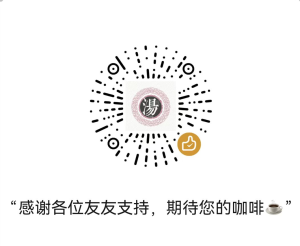

# 汉化包说明

Github发布:  [TiomTang/Empyrion-Chinese-Translation](https://github.com/TiomTang/Empyrion-Chinese-Translation)（关注不迷路）

---

## 【说明】

这是一份采集自网上流行版本的汉化文件，经过本人细心校对，基本消除了各种ffffff的颜色代码、各种错行，以及进行小幅度的翻译内容修正。由于原RE1的语言文件就有部分词条缺失（够乱的），因为不知道内容，无法修正。除此之外，有错漏的地方欢迎补充。

RE2的文档8/17加入施工，不定时更新。(已完成)

本汉化项目将会持续跟进游戏的更新而更新，并不断补充完善。

## 【汉化适用】

1. 帝国霸业银河生存游戏本体 1.15
2. Mod：重铸伊甸园1 Build 86 (仅做修复，不再深度汉化)
3. Mod：重铸伊甸园2 Build 41

注意：本体汉化必打，Mod是玩哪个打哪个

## 【使用方法】

### 一、Steam

1. 下载：

    - 右上角绿色Code→Download ZIP，解压后按下面方法覆盖游戏原文件即可。
2. 本体汉化：

    - 找到游戏本体所在的目录，在Steam库页面，左边目录找到游戏名称，右键点击游戏选择【管理】>【浏览本地文件】，如：C:\Steam\steamapps\common\Empyrion - Galactic Survival
    - 将【必需 - 本体汉化】里面文件复制到该目录，覆盖原文件即可。
3. Reforged Eden 1/2 Mod汉化：

	将【Mod汉化 - Reforged Eden 1】/【Mod汉化 - Reforged Eden 2】里面文件复制到相应Mod根目录目录。（请按你们实际的steam安装游戏路径，假如都装C盘即如下路径）

    - RE1目录：C:\Steam\steamapps\workshop\content\383120\2550354956
    - RE2目录：C:\Steam\steamapps\workshop\content\383120\3143225812

### 二、Epic

1. 下载：

	- 右上角绿色Code→Download ZIP，解压后按下面方法覆盖游戏原文件即可。
2. 本体汉化：

    - 将目录 【必需 - 本体汉化】 里面的【Content】覆盖到游戏根目录同名目录。
3. Mod汉化：

    - 首先把mod打上，一般应该放到游戏根目录路径如：【Empyrion - Galactic Survival\Content\Scenarios】中，如RE2解压出来是【Reforged Eden 2】文件夹，整个拖到【Scenarios】目录中，然后看起来路径应该是【Empyrion - Galactic Survival\Content\Scenarios\Reforged Eden 2】。
    - 然后打汉化包，将【Mod汉化 - Reforged Eden 2】目录里面所有东西拖到上面的Mod本体里面，提示覆盖后确定。RE1也是这样打。

### 三、服务器

1. 使用【本体汉化】里Content目录覆盖游戏根目录下的Content文件夹。
2. 使用剧本启动游戏，如Reforged Eden 2，则到如下路径 Content\Scenarios\Reforged Eden 2，把汉化文件覆盖上去。

### 四、关于玩RE2服务器，而服务器又不及时更新汉化文件解决方法

此方法只适合服务器缺少汉化词条的补充，不能做到已有词条的更新，有条件的还是要服务器所有权人更新语言文件。  
使用方法：将项目里面的"玩RE2服务器专用，汉化POI\Localization.csv"文件，替换本体语言文件，路径如："C:\Steam\steamapps\common\Empyrion - Galactic Survival\Content\Extras\Localization.csv"

## 【注意事项】

1. 现发现PDA的汉化文本在旧存档不生效，必须开新档。不清楚这是游戏机制问题还是游戏程序的问题。为确保汉化文本正确加载，尽量使用新档。  
    感谢#1兄弟提出的一个解决方法，在游戏中按~键呼出控制台，输入pda readdata,刷新pda数据，实测可以生效，可能会有一个副作用是会重置任务进度，酌情考虑使用哈！
2. 现发现个别NPC无法正常对话，表现对话框为空。经排查后，不是文本问题，应该是游戏本体对中文的一个bug。切换为英文后小退再进入可以继续对话，对话完后再切回中文即可。

---

**如果您对我的项目感到满意，可以请我喝杯咖啡吗？**

感谢名单：youzi（贴吧）、杨文、史莱姆、Think and do、怀念小时候的空气、陈+、向阳、Z+、Nikita Buyanov 等（以及部分匿名小伙伴）

‍
